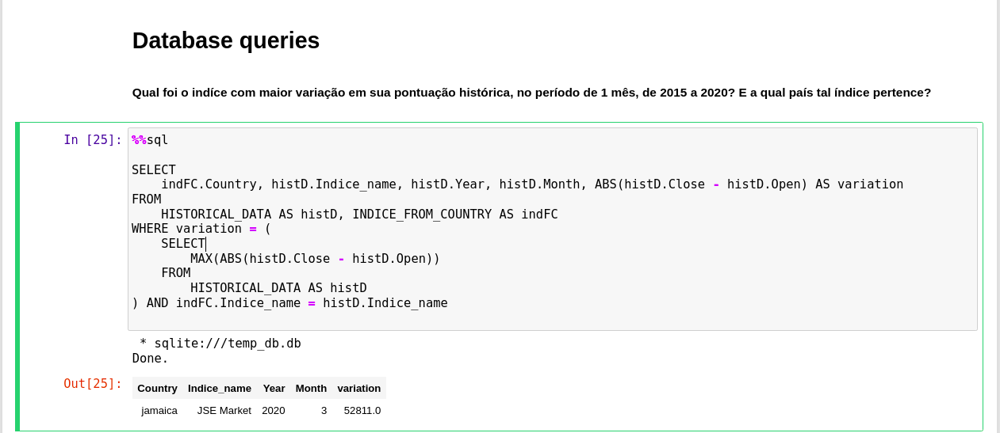

# Projeto <em>Índices econômicos mundiais</em>

# Equipe <em>Invest Bank - INVB3</em>
- Leonardo Rener de Oliveira - 201270
- César Guedes Carneiro - 261031
- Matheus Silva de Deus - 241882

## Resumo do Projeto
O grupo apresenta como proposta a construção de um dataset contendo dados históricos, no últimos anos, dos índices econômicos de países, como o Bovespa, no caso do Brasil, e o Dow Jones e Nasdaq para os Estados Unidos, por exemplo.

Nossa motivação é disponibilizar estes dados de maneira acessível, gratuita e com uma boa organização. Desta forma, tornando mais simples o processo de estudo, para alguém que tenha interesse de estudar tais tipos de dados.

Esperamos que com o projeto aqui apresentado, sejam possíveis aplicações de análises estatísticas sobre os dados, de forma a responder perguntas do tipo: Qual foi a evolução de determinado indíce em certo período de tempo? Como ele se compara com outros índices? Qual sua relação com o desenvolvimento econômico de determinado país? Dentre muitas outras perguntas que possam ser consideradas, limitadas apenas pela criatividade de quem estiver a manipular tais informações históricas.

## Slides da Apresentação
[Slides](assets/slides/apresentacao_previa.pdf)

## Modelo Conceitual

## Modelos Lógicos

### Modelos Relacional
~~~
País(_nome_)
PIB(_país_, _ano_, valor)
    país chave estrangeira -> País(nome)
Índice_Econômico(_nome_, moeda)
Pertence(_país_, _índice_)
    país chave estrangeira -> País(nome) e índice chave estrangeira -> Índice(nome)
Histórico_de_preços(_índice_, _ano_, _mês_, pontosAbertura,  pontosFechamento)
    CHE: indíce para Índice_Econômico
~~~

### Modelos Hierárquicos (XML e JSON)

## Dataset a ser Publicado

título do arquivo/base | link | breve descrição
----- | ----- | -----
`INVB3` | [base](data/processed) | `Pasta contendo os dados em CSV do Dataset`

## Bases de Dados
título da base | link | breve descrição
----- | ----- | -----
`<IMF - Gross Domestic Product>` | `https://data.imf.org/regular.aspx?key=63122827` | `Base de dados da International Monetary Fund, contendo o PIB de todos os paises`
`Wolrd indices` | `https://www.investing.com/indices/world-indices` | `Base de dados com as mais variadas informações econômicas sobre países`

## Detalhamento do Projeto

* Extração de dados:
    A extração dos dados foi feita em sua maior parte através de um API scraper, através de uma biblioteca do Python chamada Investpy e scripts implementados por nós. Utilizamos tal scraper para capturar os países, moeda, nome de índices e suas pontuações históricas ao longo dos anos.

    Além disso, foi também feita uma extração manual de dados, para a coleta da planilha do GDP dos países listados no dataset.

* Integração de dados de múltiplas fontes:
    Realizamos a integração dos dados da Investing com a International Monetary Fund (IMF), através do relacionando dos índices financeiros com o PIB dos países.

* Tratamento de dados:
    Foi necessário um tratamento dos dados de PIB recebidos da International Monetary Fund (IMF), isso porque alguns países não possuíam o valor do PIB durante todo o período apurado (2015 a 2020). Realizamos a substituição desses dados faltante que continham o valor “...” para o valor null, assim tornando o campo PIB somente de valores numéricos ou nulos.

* Transformação de dados para facilitar análise e pesquisa: 
    Foi feito a transformação dos dados do modelo relacional, armazenado em csv's, para o modelo de documentos, armazenado em json. Essa transformação foi feita no seguinte [notebook](notebooks/Montador_Hierarquico.ipynb).

## Evolução do Projeto
O primeiro modelo conceitual, foi construído com base na ideia inicial do dataset.

Por isso, ao adicionar mais dados ao dataset foi preciso mudar o modelo conceitual para o atual, incluindo o PIB, além da moeda usada por cada índice.
Quanto ao modelo de documentos, o grupo estava tendo dificuldades para distinguir este modelo do modelo relacional, isso refletiu em um modelo muito simples apresentado abaixo:

Porém, conforme o grupo entendeu melhor como diferenciar os dois modelos lógicos, foi possível ver o modelo de documentos por outra visão, tentando aproveitar melhor da hierarquia deste tipo de modelo. O resultado dessa mudança de perspectiva pode ser observada no modelo de documentos atual.

## Perguntas de Pesquisa/Análise Combinadas e Respectivas Análises

### Perguntas/Análise com Resposta Implementada

#### Pergunta/Análise 1
* Qual a previsão do GDP de um pais com base nos valores de abertura e fechamento do índice econômico do mês de um determinado mês?
>   

 Para realizar essa pergunta foi necessário primeiramente separar os dados do índice de um país desejado, depois juntá-los com os dados do GDP de tal país. Após isso, foi realizado um processamento em tais dados, para normalizá-los. Aplicando então o modelo de regressão linear na predição, obtemos as saídas esperadas para o GDP. Para o teste foi escolhido o pais Brasil, com dados de base de 2015 a 2019, deixando o ano de 2020 vazio propositalmente para comparar o resultado gerado com o valor real. Obtivemos um GDP de 7544245, e o valor real é de 7447858, se mostrando uma aproximação razoavelmente boa.
>   [Orange Workflow](notebooks/orange_workflow.ows)

>   * Resultado esperado: 
>   * Resultado obtido: 

#### Pergunta/Análise 2
* Qual foi o indíce com maior variação em sua pontuação histórica, no período de 1 mês, de 2015 a 2020? E a qual país tal índice pertence?

Tal pergunta foi desenvolvida com o intuito de analisar o potencial de queries SQL em um banco de dados relacional criado a partir dos dados disponibilizados por este dataset. A resposta foi obtida de acordo com a figura a seguir:

> 

Você pode encontrar o código de criação e manipulação do banco de dados SQL neste [notebook](notebooks/Consultas_Dataset.ipynb)

##### As Perguntas/Análises 3 e 4 foram feitas utilizando o mesmo [notebook](notebooks/Mongodb.ipynb) em python usando a biblioteca [PyMongo](https://pymongo.readthedocs.io/en/stable/).

#### Pergunta/Análise 3
* Qual a média histórica (2015-2020) para o PIB de todos os países ?
   * Para responder essa pergunta será preciso acessar vários valores de PIB, um para cada ano, para cada um dos países. A solução adotada foi utilizar o MongoDB para retornar todos os valores de PIB, independente do país e ano, soma-lós e dividir pela quantidade de valores.
~~~python
a = countries.find(
    {},
    {"years.GDP":1,"_id":0}
)
rep = 0
som = 0
for i in a:
    for j in i['years']:
        if(j):
            if isinstance(j['GDP'],float):
                som += j['GDP'] 
        rep += 1
som = som/rep
print(som)
~~~

#### Pergunta/Análise 4
* Quais países, obtiveram desempenho maior do que a média histórica do PIB, no ano de 2019?
   * Para solucionar essa pergunta utilizaremos o valor da média histórica encontrada na Pergunta/Análise 3. Novamente utilizamos o MongoDB, retornando o nome dos países que atendem o requisito.
~~~python
b = countries.find(
    { "years": {"$elemMatch":
                { "year": 2019,
                  "GDP": { "$gt": 244682543.798},
                }
            }
    },
    {'name.$': 1,"_id":0}
)
for i in b:
  print(i)
~~~
