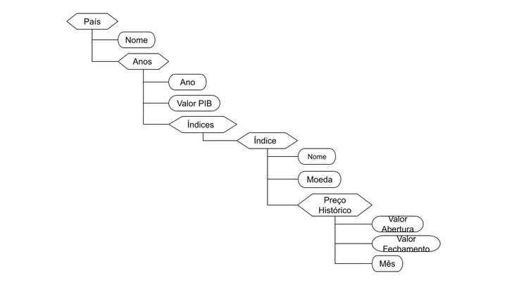

# Projeto <em>Índices econômicos mundiais</em>

# Equipe <em>Invest Bank - INVB3</em>
- Leonardo Rener de Oliveira - 201270
- César Guedes Carneiro - 261031
- Matheus Silva de Deus - 241882

## Resumo do Projeto
O grupo apresenta como proposta a construção de um dataset contendo dados históricos, no últimos anos, dos índices econômicos de países, como o Bovespa, no caso do Brasil, e o Dow Jones e Nasdaq para os Estados Unidos, por exemplo.

Nossa motivação é disponibilizar estes dados de maneira acessível, gratuita e com uma boa organização. Desta forma, tornando mais simples o processo de estudo, para alguém que tenha interesse de estudar tais tipos de dados.

Esperamos que com o projeto aqui apresentado, sejam possíveis aplicações de análises estatísticas sobre os dados, de forma a responder perguntas do tipo: Qual foi a evolução de determinado indíce em certo período de tempo? Como ele se compara com outros índices? Qual sua relação com o desenvolvimento econômico de determinado país? Dentre muitas outras perguntas que possam ser consideradas, limitadas apenas pela criatividade de quem estiver a manipular tais informações históricas.

## Slides da Apresentação
[Slides](slides/apresentacao2.pdf)

## Modelo Conceitual Preliminar

## Modelos Lógicos Preliminares

### Modelos Relacional
~~~
País(_nome_)
PIB(_país_, _ano_, valor)
    país chave estrangeira -> País(nome)
Índice_Econômico(_nome_, moeda)
Pertence(_país_, _índice_)
    país chave estrangeira -> País(nome) e índice chave estrangeira -> Índice(nome)
Histórico_de_preços(_índice_, _ano_, _mês_, pontosAbertura,  pontosFechamento)
    CHE: indíce para Índice_Econômico
~~~

### Modelos Hierárquicos (XML e JSON)

## Dataset Preliminar a ser Publicado
> Elencar os arquivos/bases preliminares dos datasets serão publicados publicados.

título do arquivo/base | link | breve descrição
----- | ----- | -----
`<título do arquivo/base>` | `<link para arquivo/base>` | `<breve descrição do arquivo/base>`

> Os arquivos finais do dataset publicado devem ser colocados na pasta `data`, em subpasta `processed`. Outros arquivos serão colocados em subpastas conforme seu papel (externo, interim, raw). A diferença entre externo e raw é que o raw é em formato não adaptado para uso. A pasta `raw` é opcional, pois pode ser substituída pelo link para a base original da seção anterior.
> Coloque arquivos que não estejam disponíveis online e sejam acessados pelo notebook. Relacionais (usualmente CSV), XML, JSON e CSV ou triplas para grafos.

## Bases de Dados
> Elencar as bases de dados fonte utilizadas no projeto.

título da base | link | breve descrição
----- | ----- | -----
`<IMF - Gross Domestic Product>` | `<https://data.imf.org/regular.aspx?key=63122827>` | `<Base de dados da International Monetary Fund, contendo o PIB de todos os paises>`

## Detalhamento do Projeto

* extração de dados de fontes não estruturadas como, por exemplo, páginas Web
* integração de dados de múltiplas fontes
* tratamento de dados
* transformação de dados para facilitar análise e pesquisa: Foi feito a transformação dos dados do modelo relacional, armazenado em csv's, para o modelo de documentos, armazenado em json. Essa transformação foi feita no seguinte [notebook](notebooks/Montador_Hierarquico.ipynb).

## Evolução do Projeto
O primeiro modelo conceitual, foi construído com base na ideia inicial do dataset.

Por isso, ao adicionar mais dados ao dataset foi preciso mudar o modelo conceitual para o atual, incluindo o PIB, além da moeda usada por cada índice.
Quanto ao modelo de documentos, o grupo estava tendo dificuldades para distinguir este modelo do modelo relacional, isso refletiu em um modelo muito simples apresentado abaixo:

Porém, conforme o grupo entendeu melhor como diferenciar os dois modelos lógicos, foi possível ver o modelo de documentos por outra visão, tentando aproveitar melhor da hierarquia deste tipo de modelo. O resultado dessa mudança de perspectiva pode ser observada no modelo de documentos atual.

## Perguntas de Pesquisa/Análise Combinadas e Respectivas Análises

> Apresente os resultados da forma mais rica possível, com gráficos e tabelas. Mesmo que o seu código rode online em um notebook, copie para esta parte a figura estática. A referência a código e links para execução online pode ser feita aqui ou na seção de detalhamento do projeto (o que for mais pertinente).

> Liste aqui as perguntas de pesquisa/análise e respectivas análises. Nem todas as perguntas precisam de queries que as implementam. É possível haver perguntas em que a solução é apenas descrita para demonstrar o potencial da base. Abaixo são ilustradas três perguntas, mas pode ser um número maior a critério da equipe.
>
### Perguntas/Análise com Resposta Implementada

As Perguntas/Análises 1 e 2 foram feitas utilizando o mesmo [notebook](notebooks/Mongodb.ipynb) em python usando a biblioteca [PyMongo](https://pymongo.readthedocs.io/en/stable/).

#### Pergunta/Análise 1
* Qual a média histórica (2015-2020) para o PIB de todos os países ?
   * Para responder essa pergunta será preciso acessar vários valores de PIB, um para cada ano, para cada um dos países. A solução adotada foi utilizar o MongoDB para retornar todos os valores de PIB, independente do país e ano, soma-lós e dividir pela quantidade de valores.
~~~python
a = countries.find(
    {},
    {"years.GDP":1,"_id":0}
)
rep = 0
som = 0
for i in a:
    for j in i['years']:
        if(j):
            if isinstance(j['GDP'],float):
                som += j['GDP'] 
        rep += 1
som = som/rep
print(som)
~~~

#### Pergunta/Análise 2
> * Pergunta 2
>   
>   * Explicação sucinta da análise que será feita e conjunto de queries que
>     responde à pergunta.

#### Pergunta/Análise 3
* Qual a previsão do GDP de um pais com base nos valores de abertura e fechamento do índice econômico do mês de um determinado mês?
  

   Para realizar essa pergunta foi necessário primeiramente separar um dados do índice pais desejado, depois juntados com os dados do GDP do pais, então foi realizado um processamento nos dados para normalizá-los, aplicando então o modelo de regressão linear na predição, obtemos as saídas esperadas para o GDP. Para o teste foi escolhido o pais Brasil, com dados de base de 2015 a 2019, deixando o ano de 2020 vazio propositalmente para comparar o resultado gerado com o valor real. Obtivemos um GDP de 7544245, e o valor real é de 7447858, se mostrando uma aproximação razoavelmente boa.
  [Orange Workflow](notebooks/orange_workflow.ows)

  * Resultado esperado: 
  * Resultado obtido: 

#### Pergunta/Análise 4
> * Pergunta 4
>   
>   * Explicação sucinta da análise que será feita e conjunto de queries que
>     responde à pergunta.

### Perguntas/Análise Propostas mas Não Implementadas

#### Pergunta/Análise 1
> * Pergunta 1
>   
>   * Explicação em linhas gerais de como a base pode ser usada para responder esta pergunta e a sua relevância.

#### Pergunta/Análise 2
> * Pergunta 2
>   
>   * Explicação em linhas gerais de como a base pode ser usada para responder esta pergunta e a sua relevância.

#### Pergunta/Análise 3
> * Pergunta 3
>   
>   * Explicação em linhas gerais de como a base pode ser usada para responder esta pergunta e a sua relevância.

> Coloque um link para o arquivo do notebook que executa o conjunto de queries. Ele estará dentro da pasta `notebook`. Se por alguma razão o código não for executável no Jupyter, coloque na pasta `src`. Se as queries forem executadas atraves de uma interface de um SGBD não executável no Jupyter, como o Cypher, apresente na forma de markdown.
