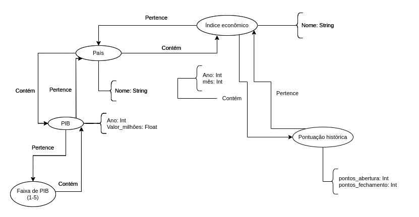

# Equipe Invest Bank - INVB3
* César Guedes Carneiro - 261031
* Leonardo Rener de Oliveira - 201270
* Matheus Silva de Deus - 241882

## Modelo Lógico Combinado do Banco de Dados de Grafos
> Coloque aqui o modelo ou modelos que serão usados pela equipe combinando os individuais, conforme especificação.

## Perguntas de Pesquisa/Análise Combinadas e Respectivas Análises

> Liste aqui as perguntas de pesquisa/análise combinadas e revisadas dos membros da equipe e respectivas análises.
>
### Pergunta/Análise 1
 * A qual país um índice pertence e quais outros índices pertencem a este mesmo país? 
   * A partir de um nó Índice Econômico, se percorre a aresta Pertence para achar o nó País a qual aquele índice pertence. Então, se acham todos os outros nós Índice Econômico que o nó País encontrado Contém. Essa análise se encaixa na modalidade Comunidade, já que é possível determinar quais índices pertencem aos mesmos países.

### Pergunta/Análise 2
> * Pergunta 2
>   
>   * Explicação sucinta da análise que será feita no grafo para atender à pergunta. Deve ser indicado explicitamente em qual das modalidades a análise se encaixa: centralidade; vulnerabilidade; comunidade/modularidade; motifs; predição de links.

### Pergunta/Análise 3
* Ao longo dos anos, qual foi a faixa de valores de PIB mais alcançada pelos países?
  *  modalidade: Centralidade
Existem 5 grupos de faixas de valores para o PIB dos países. O cálculo para essas faixas é realizado tomando o menor e maior PIB dentre os países, ao longo dos anos. A diferença entre esses valores é dividida em 5 partes, para as quais são relacionadas uma das 5 faixas de PIB.
Utilizando a ideia de centralidade por grau, deve-se observar qual dos grupos está conectado por mais arestas. Será essa a faixa de valor buscada por nós.
Desta forma, torna-se possível, ainda, a realização de outras análises à parte, como, por exemplo, a possibilidade de comparar a situação econômica dos países que, em algum momento, fizeram parte da faixa de PIB encontrada.
