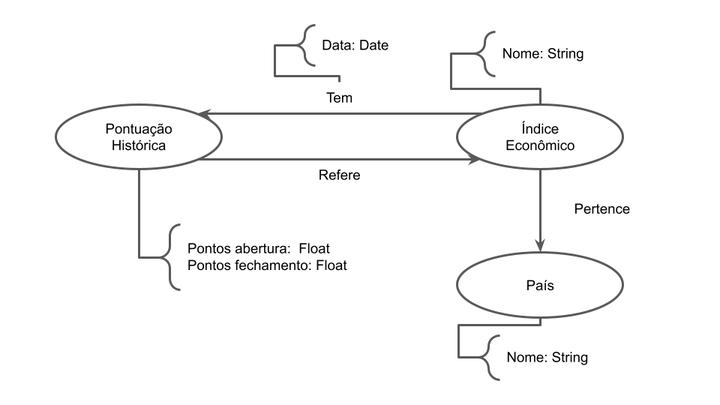

# Equipe Invest Bank - INVB3
* César Guedes Carneiro - 261031
* Leonardo Rener de Oliveira - 201270
* Matheus Silva de Deus - 241882

## Modelo Lógico Combinado do Banco de Dados de Grafos
> Coloque aqui o modelo ou modelos que serão usados pela equipe combinando os individuais, conforme especificação.

## Perguntas de Pesquisa/Análise Combinadas e Respectivas Análises

> Liste aqui as perguntas de pesquisa/análise combinadas e revisadas dos membros da equipe e respectivas análises.
>
### Pergunta/Análise 1
 * A qual país um índice pertence e quais outros índices pertencem a este mesmo país? 
   * A partir de um nó Índice Econômico, se percorre a aresta Pertence para achar o nó País a qual aquele índice pertence. Então, se acham todos os outros nós Índice Econômico que o nó País encontrado Contém. Essa análise se encaixa na modalidade Comunidade, já que é possível determinar quais índices pertencem aos mesmos países.

### Pergunta/Análise 2
> * Pergunta 2
>   
>   * Explicação sucinta da análise que será feita no grafo para atender à pergunta. Deve ser indicado explicitamente em qual das modalidades a análise se encaixa: centralidade; vulnerabilidade; comunidade/modularidade; motifs; predição de links.

### Pergunta/Análise 3
> * Pergunta 3
>   
>   * Explicação sucinta da análise que será feita no grafo para atender à pergunta. Deve ser indicado explicitamente em qual das modalidades a análise se encaixa: centralidade; vulnerabilidade; comunidade/modularidade; motifs; predição de links.
