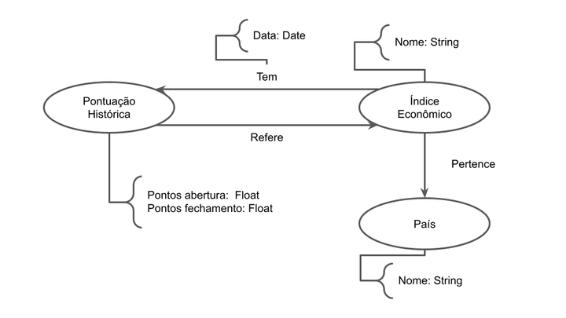

# Equipe Invest Bank - INVB3
* César Guedes Carneiro - 261031
* `<nome completo>` - `<RA>`
* `<nome completo>` - `<RA>`

## Modelo Lógico Combinado do Banco de Dados de Grafos
> Coloque aqui o modelo ou modelos que serão usados pela equipe combinando os individuais, conforme especificação.

## Perguntas de Pesquisa/Análise Combinadas e Respectivas Análises

> Liste aqui as perguntas de pesquisa/análise combinadas e revisadas dos membros da equipe e respectivas análises.
>
### Pergunta/Análise 1
> * Pergunta 1
>   
>   * Explicação sucinta da análise que será feita no grafo para atender à pergunta. Deve ser indicado explicitamente em qual das modalidades a análise se encaixa: centralidade; vulnerabilidade; comunidade/modularidade; motifs; predição de links.

### Pergunta/Análise 2
> * Pergunta 2
>   
>   * Explicação sucinta da análise que será feita no grafo para atender à pergunta. Deve ser indicado explicitamente em qual das modalidades a análise se encaixa: centralidade; vulnerabilidade; comunidade/modularidade; motifs; predição de links.

### Pergunta/Análise 3
> * Pergunta 3
>   
>   * Explicação sucinta da análise que será feita no grafo para atender à pergunta. Deve ser indicado explicitamente em qual das modalidades a análise se encaixa: centralidade; vulnerabilidade; comunidade/modularidade; motifs; predição de links.
